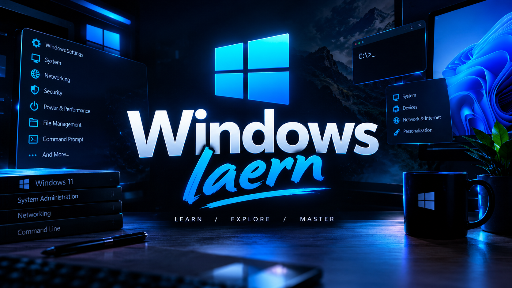

  

  <h1>🪟 Windows Learn</h1>

  <h3>Learn Windows. Understand Windows. Master Windows.</h3>

  

    An open-source educational repository for learning
    <strong>Microsoft Windows</strong> from the basics to advanced concepts.
  

  

    <strong>Learn</strong> •
    <strong>Explore</strong> •
    <strong>Understand</strong> •
    <strong>Master</strong>
  

<h2>📖 About</h2>

  <strong>Windows Learn</strong> is an open-source educational project created
  to help people learn and understand the <strong>Windows operating system</strong>
  in a practical and organized way.

  The goal of this repository is to build a continuously growing knowledge base
  covering Windows fundamentals, system administration, networking, security,
  troubleshooting, command-line tools, and many other useful topics.

  Whether you're a beginner or already familiar with Windows, this repository
  is designed to help you improve your knowledge step by step.

<h2>🚀 What You'll Learn</h2>

<ul>
  <li>🖥️ <strong>Windows Fundamentals</strong></li>
  <li>⚙️ <strong>System Settings & Configuration</strong></li>
  <li>📁 <strong>File & Folder Management</strong></li>
  <li>💻 <strong>Command Prompt (CMD)</strong></li>
  <li>🔵 <strong>PowerShell</strong></li>
  <li>🌐 <strong>Networking & Internet Configuration</strong></li>
  <li>🔐 <strong>Windows Security</strong></li>
  <li>👤 <strong>Users, Accounts & Permissions</strong></li>
  <li>⚡ <strong>Performance & Optimization</strong></li>
  <li>💾 <strong>Storage & Disk Management</strong></li>
  <li>🛠️ <strong>Troubleshooting</strong></li>
  <li>🔧 <strong>Windows Tools & Utilities</strong></li>
  <li>📋 <strong>Task Manager & System Monitoring</strong></li>
  <li>🧩 <strong>Windows Services</strong></li>
  <li>📝 <strong>Windows Registry</strong></li>
  <li>🔄 <strong>Windows Updates & Recovery</strong></li>
  <li>⌨️ <strong>Keyboard Shortcuts</strong></li>
  <li>💡 <strong>Tips, Tricks & Useful Techniques</strong></li>
</ul>

<em>And much more...</em>

<h2>🎯 Who Is This For?</h2>

<strong>Windows Learn</strong> is designed for:

<ul>
  <li>🧑‍💻 Beginners learning Windows</li>
  <li>🎓 Students interested in IT and computer science</li>
  <li>🔧 People who want to improve their computer skills</li>
  <li>🌐 Networking enthusiasts</li>
  <li>💻 Developers who want to understand Windows better</li>
  <li>🛡️ People interested in Windows security</li>
  <li>🖥️ Future system administrators</li>
  <li>📚 Anyone who wants to learn more about Windows</li>
</ul>

You don't need advanced knowledge to get started.

<h2>📚 Learning Approach</h2>

  The main focus of this project is <strong>practical learning</strong>.

  Instead of simply explaining what something is, each topic aims to answer
  four important questions:

<pre>
What is it?
    ↓
How does it work?
    ↓
How do I use it?
    ↓
Where can I use it in practice?
</pre>

Where appropriate, topics include:

<ul>
  <li>📖 Explanations</li>
  <li>💻 Commands</li>
  <li>🧪 Practical examples</li>
  <li>🛠️ Step-by-step instructions</li>
  <li>💡 Useful tips</li>
  <li>⚠️ Important notes</li>
  <li>🔍 Troubleshooting techniques</li>
</ul>

<h2>🌱 Recommended Learning Path</h2>

If you're completely new to Windows, you can follow this path:

<pre>
Windows Fundamentals
        ↓
System & File Management
        ↓
CMD & PowerShell
        ↓
Networking
        ↓
Windows Security
        ↓
Troubleshooting
        ↓
Performance & Optimization
        ↓
Advanced Windows Administration
</pre>

You can also jump directly to any topic you're interested in.

<h2>💻 Practical Examples</h2>

  Throughout the repository, you'll find practical Windows commands and examples.

<h3>System Information</h3>
<pre><code>systeminfo</code></pre>

<h3>Network Configuration</h3>
<pre><code>ipconfig</code></pre>

<h3>Test Network Connectivity</h3>
<pre><code>ping 8.8.8.8</code></pre>

<h3>View Running Processes</h3>
<pre><code>Get-Process</code></pre>

<h3>View Windows Services</h3>
<pre><code>Get-Service</code></pre>

  These are only a few examples. More commands and practical use cases
  will be added throughout the project.

<h2>🗂️ Repository Structure</h2>

<pre>
Windows-Learn/
│
├── assets/
│   └── windows-learn-banner.png
│
├── Basics/
├── System/
├── File-Management/
├── CMD/
├── PowerShell/
├── Networking/
├── Security/
├── Performance/
├── Storage/
├── Troubleshooting/
│
└── README.md
</pre>

  <em>
    The repository structure may change and expand as new topics and lessons
    are added.
  </em>

<h2>🔐 Security</h2>

  Windows provides many powerful tools for system administration, networking,
  and security.

Security-related topics in this repository are intended for:

<ul>
  <li>🛡️ Learning</li>
  <li>🧪 Testing</li>
  <li>🔬 Research</li>
  <li>🖥️ System administration</li>
  <li>🔐 Improving system security</li>
</ul>

  Always use security and administration techniques responsibly and only on
  systems you own or have permission to manage.

<h2>🤝 Contributing</h2>

  <strong>Windows Learn</strong> is an open-source learning project,
  and contributions are welcome.

You can contribute by:

<ul>
  <li>📝 Improving explanations</li>
  <li>🐛 Fixing mistakes</li>
  <li>💡 Adding useful examples</li>
  <li>📚 Creating new tutorials</li>
  <li>🔧 Improving existing content</li>
  <li>🔍 Adding useful Windows tips</li>
  <li>📖 Improving documentation</li>
</ul>

  If you find something that could be improved, feel free to open an
  <strong>Issue</strong> or submit a <strong>Pull Request</strong>.

<h2>⭐ Support the Project</h2>

  If you find <strong>Windows Learn</strong> useful, consider giving the
  repository a ⭐ on GitHub.

  Your support helps the project reach more people and motivates continued development.

<h2>📌 Project Goal</h2>

<blockquote>
  <strong>
    Build a practical, organized, and continuously growing knowledge base
    for learning Windows.
  </strong>
</blockquote>

  From basic computer skills to advanced Windows administration,
  this project aims to make Windows easier to understand and easier to learn.

  <h2>🪟 Windows Learn</h2>

  <h3>Learn • Explore • Understand • Master</h3>

  

    <strong>Made with ❤️ for the Windows community.</strong>
  

